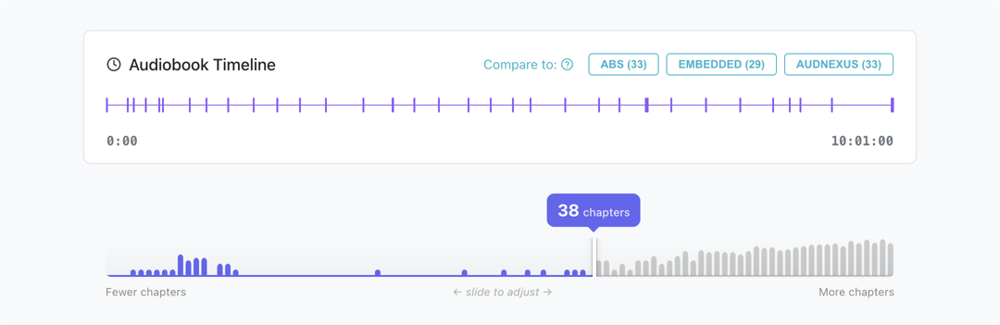

  <picture>
    <source media="(prefers-color-scheme: dark)" srcset="docs/img/hero-dark.webp">
    <source media="(prefers-color-scheme: light)" srcset="docs/img/hero-light.webp">
    
  </picture>

  <h3><a href="https://achew.readthedocs.io"><strong>Explore the docs »</strong></a></h3>

  

    <a href="https://achew.readthedocs.io/latest/#demo-video">View Demo</a>
    &middot;
    <a href="https://achew.readthedocs.io/latest/troubleshooting/logs-and-support/#filing-a-bug-report">Report Bug</a>
    &middot;
    <a href="https://achew.readthedocs.io/latest/troubleshooting/logs-and-support/#requesting-a-feature">Request Feature</a>
  

## About

**Achew** is an Audiobook Chapter Extraction Wizard. Designed to work with [Audiobookshelf](https://www.audiobookshelf.org/), it helps you analyze your audiobook files to find chapters and generate titles.

  <picture>
    <source media="(prefers-color-scheme: dark)" srcset="docs/img/timeline-histogram-dark.webp">
    <source media="(prefers-color-scheme: light)" srcset="docs/img/timeline-histogram-light.webp">
    
  </picture>

## Features at a glance

- **Smart Chapter Detection** to find chapter cues from the audio itself.
- **Use existing chapters** from Audiobookshelf, Audnexus, embedded chapters, and more.
- **Realign chapters** when timestamps don't quite line up.
- **Title Transcription** with on-device models.
- **AI Cleanup** for consistent title formatting via OpenAI, Claude, Gemini, OpenRouter, Copilot, Ollama, or LM Studio.
- **Interactive Chapter Editor** with undo/redo, batch operations, and audio previews.
- **Chapter Search** to audit your library using customizable rules.
- **Export** to CSV, JSON, or CUE, or save back to Audiobookshelf.
- **Cross-platform**: Windows, Linux, macOS, and Docker.

### View the full documentation at **[achew.readthedocs.io](https://achew.readthedocs.io)**

## Quick install

| Platform | Guide |
| --- | --- |
| Docker | [Install with Docker](https://achew.readthedocs.io/latest/installation/installation-docker/) |
| Linux / macOS | [Install on Linux or macOS](https://achew.readthedocs.io/latest/installation/installation-linux-macos/) |
| Windows | [Install on Windows](https://achew.readthedocs.io/latest/installation/installation-windows/) |

After installation, follow the [first-run walkthrough](https://achew.readthedocs.io/latest/installation/first-run/) to connect Audiobookshelf.

## Links

- [Full documentation](https://achew.readthedocs.io)
- [FAQ](https://achew.readthedocs.io/latest/faq/)
- [Troubleshooting](https://achew.readthedocs.io/latest/troubleshooting/)
- [Report an issue](https://achew.readthedocs.io/latest/troubleshooting/logs-and-support/#filing-a-bug-report)
- [Request a feature](https://achew.readthedocs.io/latest/troubleshooting/logs-and-support/#requesting-a-feature)
