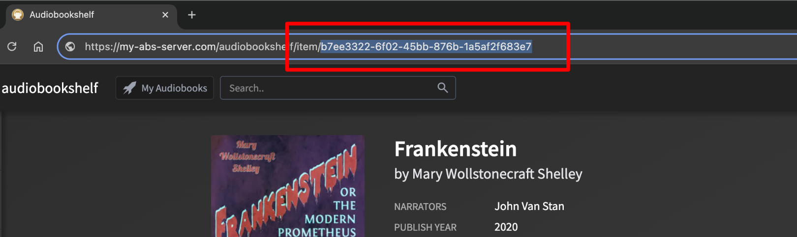

# Finding a Book

Before starting a workflow, you select the audiobook you want to work on from Achew's main book search screen. There are three ways to find a book: searching by title, specifying an item ID directly, or using Chapter Search to filter your entire library using a set of rules.

  
  

## Search by title

Type part of the title into the search bar and pick the book from the results. Simple enough.

  
  

## Specify an item ID

If you know the book's Audiobookshelf item ID, you can enter it to directly look up the item.

The item ID appears in the Audiobookshelf URL for the book, after `/item/`:

  
  

## Chapter Search

Chapter Search scans your Audiobookshelf libraries to find books whose chapters match rules you define. This makes it easy to discover books that need better chapters, e.g. books with no chapters, books without an intro chapter, books where all titles are just numbers, and so on.

For a step-by-step walkthrough, see [Audit your library with Chapter Search](../examples/audit-library-with-chapter-search.md).

---

### Search page

The search page has three areas: a Library Selector and Search button at the top, the [Rule List](#working-with-the-rule-list) in the middle, and [Library Stats](#library-stats) and [Clear Cache](#cache-management) buttons at the bottom.

Use the Library Selector dropdown to choose a library, then click the Search button to start searching that library using the enabled rules.

---

### Rules and Rulesets

A **rule** describes a pattern to look for in a book's chapter data. Rules are organized into **rulesets**, which are named groups of rules that can be nested. The main Rule List is a ruleset.

---

### Working with the Rule List

#### Adding a rule

Click **Add Rule** at the bottom of any ruleset to open the [Rule Editor](#rule-editor). Configure the target, conditions, and an optional name, then click **Save**.

#### Editing or deleting a rule

Click the pencil icon on any rule row to open the [Rule Editor](#rule-editor). Click **Delete** to remove the rule, or click **Clone** to duplicate it as a new rule.

#### Adding a nested ruleset

Click **Add ruleset** at the bottom of any ruleset to open the ruleset editor. A ruleset takes an optional name, and must use one of two modes for matching:

- **Match Any:**  The ruleset matches if any rule inside it matches (OR logic).
- **Match All:**  The ruleset matches only if every rule inside it matches (AND logic).

{ width="320"}
{ width="320"}

#### Editing a ruleset

Click the pencil icon on a ruleset's header to rename it, change its match mode, or delete it. Deleting a ruleset deletes all the rules and rulesets it contains.

!!! info "Deleting the root ruleset"
    For the root ruleset (i.e. the main Rule List), the Delete button is replaced with a **Reset All Rules** button. Clicking this will delete the entire rule list and replace it with the default starting rules.

#### Enabling and disabling

Every rule and ruleset has an enable/disable checkbox. Disabled items are dimmed and skipped during searches. If a ruleset is disabled, all rules inside it are skipped too.

#### Drag-and-drop reordering

Rules and rulesets can be dragged to any position, including into or out of nested rulesets. This does not affect search results (order is irrelevant), but it helps you organize complex rule trees.

---

### Rule Editor

The Rule Editor allows you to change a rule's name, target, and conditions.

{ width="420"}
{ width="420"}

#### Rule Name

A custom name can be specified for any rule. This name does not have to be unique. If no name is specified, one will be automatically generated using the rule's target and conditions.

#### Rule targets

Each rule requires a **Target** that defines which chapters to inspect:

| Target | Meaning |
|--------|---------|
| **Any chapter** | True if at least one chapter matches |
| **Every chapter** | True if all chapters match |
| **First chapter** | True if the first chapter matches |
| **Last chapter** | True if the last chapter matches |
| **Every middle chapter** | True if every chapter except the first and last matches |
| **Any middle chapter** | True if any chapter except the first and last matches |
| **Most every chapter** | True if at least two-thirds of chapters match |
| **Chapter count** | True if the total chapter count matches a numeric condition |

#### Text conditions

For chapter-title targets, each condition specifies:

- **Operation:**  `matches`, `does not match`, `contains`, `does not contain`, `starts with`, `does not start with`, `ends with`, or `does not end with`
- **Comparison type:**  `the text` (exact, case-optional), `text similar to` (fuzzy), `a number`, `the book title` (exact or similar), or `the regex`
- **Value:**  The text or regex pattern to test against (not required for "a number" or book-title comparisons).
- **Ignore case** checkbox: available for exact text and regex comparisons.

#### Count conditions

For the **Chapter count** target, each condition is a numeric comparison: `is`, `is not`, `is less than`, `is not less than`, `is greater than`, or `is not greater than`, followed by a number.

#### Multiple conditions on one rule

All targets support multiple conditions joined by AND. Click **Add condition** in the rule dialog to add more. For example: "`Any chapter` `starts with` `the text` `"track"` AND `contains` `a number`."

#### Fuzzy matching

Conditions phrased as ***similar*** or ***similar to*** use fuzzy, case-insensitive comparison. They match text that is substantially similar to the provided value, which is useful for catching chapter titles that closely resemble a word, phrase, or the book title without needing an exact match.

---

### Results page

#### Book List (left panel)

Shows every book that matched at least one rule, sorted alphabetically. Ignored books are hidden by default. Click a book to view its details in the right panel.

#### Book Details (right panel)

Displays the selected book's chapter list, as well as the following:

- **Matched rules:**  A summary of which rules triggered for this book.
- **Ignore / Unignore:**  Marks the book so it is excluded from the results list.
- **Start:**  Begins processing this book.

---

### Ignoring books

Click **Ignore** in the right panel to mark a book as ignored. Ignored books are excluded from the results list for the current and future searches. To see ignored books, check **Show ignored books** in the top right. From there you can **Unignore** a book to include it in future searches.

Use this to mark books you have already processed or that you know do not need attention.

---

### Cache management

Achew caches chapter data from Audiobookshelf to speed up future searches. The first time you search a library, Achew performs a full sync that can take several minutes for large libraries. Subsequent searches are much faster.

Changes you make to a book through Achew are automatically reflected in the cache. However, edits made directly in Audiobookshelf or through another tool are not tracked, and the cache will be out of date until you manually refresh it. Two ways to do this:

- Click the **Clear Cache** at the bottom of the Search page. This forces a full re-sync of the entire library on the next search.
- Click the :lucide-rotate-cw: **Refresh button** at the top of the Results page. This re-syncs only the books currently in the results list.

---

### Library Stats

Click **Library Stats** at the bottom of the Search page to view statistics for the selected library:

- Book count, chapter counts, and averages
- Total and average book/chapter durations
- How long it would take to listen to the entire library at roughly 40 hours/week
- Books with the most chapters, longest chapter duration, longest total duration, and shortest total duration, and longest chapter title
- Most frequent words appearing in chapter titles (common words and numbers excluded)

