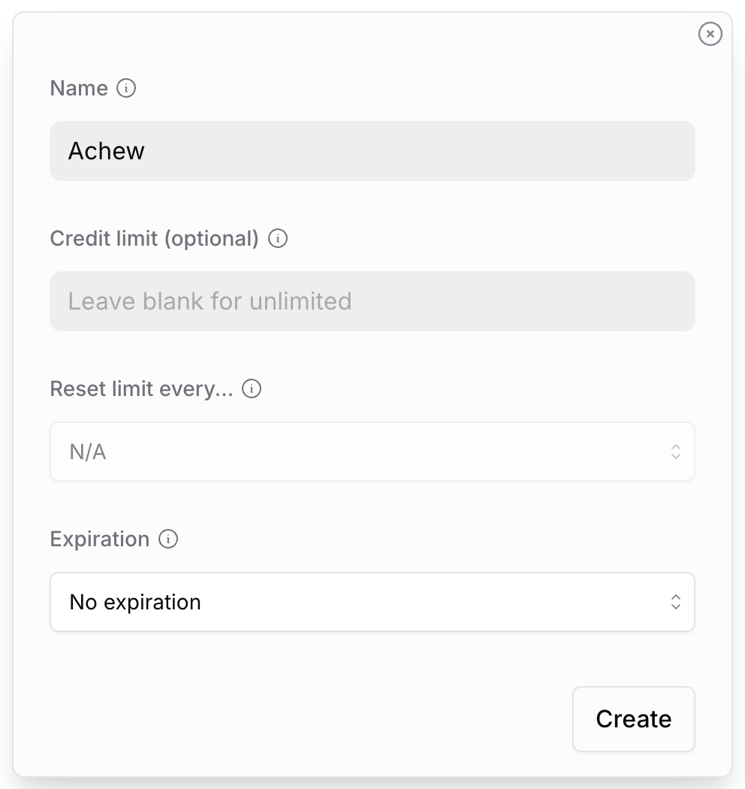

# LLM Providers

Achew supports several LLM providers for [AI Cleanup](../editor/ai-cleanup.md). You can configure as many as you like, but only one can be used per cleanup run. All provider settings live in **Settings → LLM Setup**.

## Free options

If you don't have any paid accounts, three providers work well at no cost:

- **[Google Gemini, free tier](#gemini-google):** (Recommended) Easiest to set up. Requires a Google account. Rate-limited, but generally fine for casual use.
- **[GitHub Copilot Free](#github-copilot):** Requires a GitHub account. Usage is limited by a monthly allowance of [GitHub AI credits](https://docs.github.com/en/copilot/concepts/billing/usage-based-billing-for-individuals){:target="_blank"} on the free tier.
- **[Ollama](#ollama) or [LM Studio](#lm-studio):** Free, unlimited, and private, at the cost of running the model yourself. 16B+ parameter models recommended; smaller ones often produce unusable results.

See the relevant provider card below for setup steps.

## Provider summary

| Provider | Cost | Field(s) | Notes |
|---|---|---|---|
| [OpenAI](#openai) | Paid | API key | Prefer `mini` models for general use, `nano` models for simple tasks, and regular models for complex cleanup. The `pro` models are slow, expensive, and generally overkill. |
| [Anthropic Claude](#claude-anthropic) | Paid | API key | Prefer `Sonnet` models for general use, `Haiku` models for simple tasks and light cleanup, and `Opus` only for very complex cleanup. |
| [Google Gemini](#gemini-google) | Free/Paid | API key | Free tier has limited model selection and [rate limits](https://ai.google.dev/gemini-api/docs/rate-limits){:target="_blank"}.    Prefer `Flash` models for most tasks, `Lite` models for simple cleanup, and `Pro` models for complex cleanup. |
| [OpenRouter](#openrouter) | Free/Paid | API key | Free tier has limited [model selection](https://openrouter.ai/collections/free-models){:target="_blank"}, a limit of [50 requests/day](https://openrouter.ai/pricing){:target="_blank"}, and spotty service. Small models do not work well; try to use 16B+ parameter models. |
| [GitHub Copilot](#github-copilot) | Free/Paid | Personal access token | Free tier has limited [model selection](https://docs.github.com/en/copilot/reference/ai-models/supported-models#supported-ai-models-per-copilot-plan){:target="_blank"} and a limited monthly allowance of [GitHub AI credits](https://docs.github.com/en/copilot/concepts/billing/usage-based-billing-for-individuals){:target="_blank"}, consumed based on token usage. |
| [Ollama](#ollama) | Free (self-hosted) | Host URL | Local, private, unlimited. Small models do not work well; try to use 16B+ parameter models. |
| [LM Studio](#lm-studio) | Free (self-hosted) | Host URL | Local, private, unlimited. Small models do not work well; try to use 16B+ parameter models. |

---

## Provider Setup Instructions

??? example "OpenAI"
    To create a key, go to <https://platform.openai.com/api-keys>{:target="_blank"}. At the bottom, click **Create new secret key**.
    
    { width="360"; .center }
    { width="360"; .center }

    In the dialog, type a name for the key (e.g. "Achew"), set permissions to `All`, then click **Create Secret Key**. After a moment it will show you the newly-created key. *Make sure to copy the key at this point*, as you won't be able to view it again.
    
    In Achew, go to **Settings -> LLM Setup** and enable the OpenAI card. Paste the API Key into the input field, then click **Validate**. Once validated, you'll be able to use OpenAI as a provider for AI Cleanup in the chapter editor.

??? example "Claude (Anthropic)"
    To create a key, go to <https://console.anthropic.com/settings/keys>{:target="_blank"}. In the top right, click **Create key**.
    
    { width="360"; .center }
    { width="360"; .center }
    
    In the dialog, select a workspace (`Default` is fine), type a name for the key (e.g. "achew") and click **Add**. After a moment it will show you the newly-created key. *Make sure to copy the key at this point*, as you won't be able to view it again.

    In Achew, go to **Settings -> LLM Setup** and enable the Claude card. Paste the API Key into the input field, then click **Validate**. Once validated, you'll be able to use Claude as a provider for AI Cleanup in the chapter editor.

??? example "Gemini (Google)"
    To create a key, go to <https://aistudio.google.com/apikey>{:target="_blank"}. In the top right, click **Create API key**.
    
    { width="420"; .center }
    { width="420"; .center }
    
    In the dialog, type a name for the key (e.g. "Achew"), select a project (`Default Gemini Project` is fine), then click **Create key**. After a moment the newly-created key will be displayed; copy it.

    In Achew, go to **Settings -> LLM Setup** and enable the Gemini card. Paste the API Key into the input field, then click **Validate**. Once validated, you'll be able to use Gemini as a provider for AI Cleanup in the chapter editor.

??? example "OpenRouter"
    One OpenRouter key fronts dozens of underlying models; you pick the specific model at cleanup time. To create a key, go to <https://openrouter.ai/keys>{:target="_blank"} and sign in. In the top right, click **Create**.
    
    { width="420"; .center }
    
    In the dialog, provide a name for the key (e.g. "Achew"), optionally set a credit limit and expiration, then click **Create**. After a moment the new key will be displayed. *Make sure to copy the key at this point*, as you won't be able to view it again.

    In Achew, go to **Settings -> LLM Setup** and enable the OpenRouter card. Paste the API Key into the input field, then click **Validate**. Once validated, you can use OpenRouter as a provider for AI Cleanup in the chapter editor.

??? example "GitHub Copilot"
    First, make sure Copilot is enabled on your GitHub account by visiting your [Copilot settings](https://github.com/settings/copilot/features){:target="_blank"}. If you have not previously enabled Copilot, you can do so by clicking the **Start Using Copilot Free** button. If you don't see this button, Copilot is likely already enabled.
    
    
    

    Next, go [here](https://github.com/settings/personal-access-tokens/new){:target="_blank"} to create a new fine-grained personal access token. 
    
    { width="640"; .center }
    { width="640"; .center }
    
    Give it a name (e.g. "Achew"), set an expiration, and add the **Copilot Requests** permission (Read-only). Click **Generate token** at the bottom, confirm, and then the token will be displayed. *Make sure to copy the token at this point*, as you won't be able to view it again.

    In Achew, go to **Settings -> LLM Setup** and enable the GitHub Copilot card. Paste the Personal Access Token into the input field, then click **Validate**. Once validated, you'll be able to use Copilot as a provider for AI Cleanup in the chapter editor.

??? example "Ollama"
    Install [Ollama](https://ollama.com/download){:target="_blank"} on your machine and pull a model (e.g. `ollama pull qwen3.6:27b`). Ollama runs a local server at `http://localhost:11434` by default.

    In Achew, go to **Settings -> LLM Setup** and enable the Ollama card. Enter the Ollama host URL into the input field, then click **Validate**. If Achew is running in Docker and Ollama is on the same host, use `http://host.docker.internal:11434` on macOS/Windows, or your LAN IP on Linux. Once validated, you'll be able to use Ollama as a provider for AI Cleanup in the chapter editor.

    !!! tip "Model size matters"
        Small models rarely produce usable results. Try to use 16B+ parameter models if possible.

??? example "LM Studio"
    Install [LM Studio](https://lmstudio.ai/){:target="_blank"}, download a model from the **Discover** tab, then start the local server from the **Developer** tab. LM Studio listens on `http://localhost:1234` by default.

    In Achew, go to **Settings -> LLM Setup** and enable the LM Studio card. Enter the host URL into the input field, then click **Validate**. Once validated, you can use LM Studio as a provider for AI Cleanup in the chapter editor.

    !!! tip "Model size matters"
        Small models rarely produce usable results. Try to use 16B+ parameter models if possible.

---

## Picking a model at cleanup time

In the chapter editor, clicking the **Clean Up Selected** button will open the **AI Cleanup** dialog. From here, you can select any configured provider. Once a provider is selected, you'll be able to choose from that provider's available models.

## Privacy

When you run AI Cleanup, Achew sends a system prompt, the book title/author, your chapter titles, and any additional instructions you've specified to the selected provider. No audio is sent. Local providers (Ollama, LM Studio) keep everything on your machine. See [Privacy and Data](../reference/privacy-and-data.md).

## Related

- [AI Cleanup](../editor/ai-cleanup.md)
- [Custom Instructions](../editor/ai-cleanup.md#custom-instructions)
