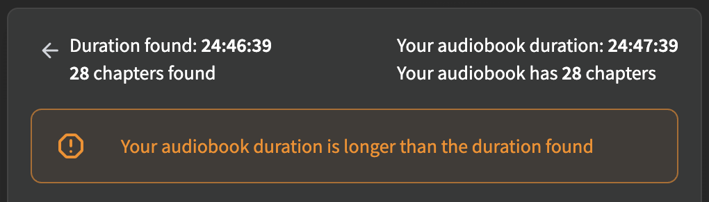

# Realign Chapters

The realignment workflow keeps the **titles** of an existing Chapter Reference and attempts to automatically fix misaligned **timestamps** by detecting cues in the audio.

## When to use it

Realignment is for situations where you have a [Chapter Reference](../getting-started/chapter-references.md) whose titles are correct, but whose timestamps are slightly off. For example, when using the chapter (Audnexus) lookup feature in Audiobookshelf, you'll often see this familiar message when the durations differ:

{ width="480"; .center }

A duration mismatch between your audiobook and the Audnexus data almost always means that the Audnexus chapters will not correctly align with your book's audio. The realignment workflow fixes this by performing targeted smart detection around the areas where it thinks the chapters should go, and then shifts the timestamps to the best-fitting locations.

!!! info "Realignment Accuracy"
    Chapter realignment works best when the book and Reference durations differ by *only a few minutes*. The greater the difference, the less accurate realignment becomes. If the durations are off by 10+ minutes, consider the possibility that your selected Reference corresponds to a different version of your book.

## Steps

1. [**Select a book**](../getting-started/finding-a-book.md) from Achew's main screen.
2. Choose **Realign Chapters** on the *Select a Workflow* screen.
3. **Pick a Reference**, e.g. Audnexus. If there are no References, or you wish use another Reference, click the **Add Chapter Reference** button near the bottom.
4. Toggle the **Dramatized** checkbox for books that contain music or sound effects. Note that dramatized detection takes significantly longer than regular detection, so it is recommended to leave this unchecked for regular audiobooks.
5. *(Rarely needed)* Toggle the **Find large shifts** checkbox if you believe one or more chapters have shifted unusually far from the Reference timestamps. This scans more of the audio to help find cues beyond the expected range, but takes significantly longer. Achew automatically widens its search when it detects that a chapter may have shifted out of scope, so it is recommended to leave this option unchecked most of the time.
6. Click the **Realign** button to start the realignment process.
7. After realignment has finished, use the [Chapter Editor](../editor/index.md) to review and polish the chapters.

## The Offset column

In the editor, the **Offset** column shows how far each chapter moved during realignment. If the chapter's offset is a guess or is low-confidence, it will have a warning icon and a different color:

{ width="560"; .center }
{ width="560"; .center }

You will want to manually review the accuracy of the chapter timestamps, especially for those marked as guesses. Use the play button (:material-play:{ .lg }) on each chapter to hear the first few seconds and confirm the timestamp is correct. You can click on timestamps to edit them directly, using the space bar to start/stop playback and the <kbd>↑</kbd>/<kbd>↓</kbd> keys to shift the timestamp by ±1 second.

!!! tip
    If realignment is wrong for most chapters, the Reference might not match the version of the book you have. Try another Reference, or use the [Smart Detect](smart-detect.md) workflow and then [Apply Titles](../editor/apply-titles.md).
